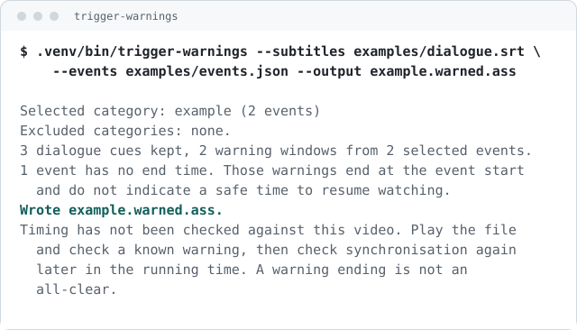
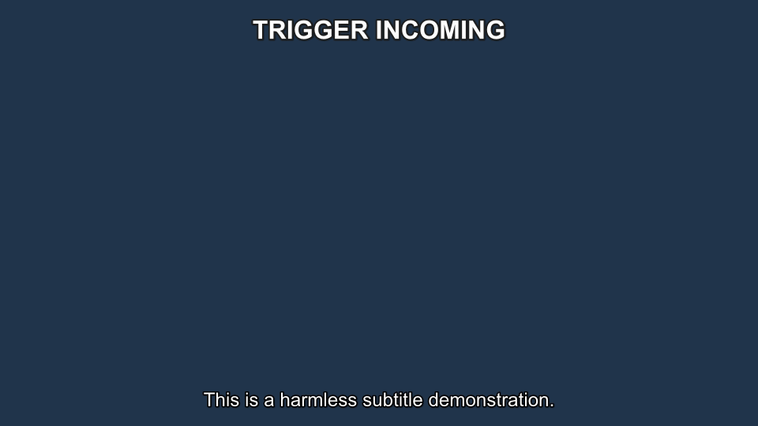
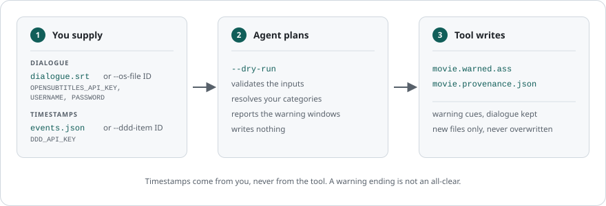

# Trigger Warnings

**Spoiler-free trigger warnings for local video.**

Create a separate subtitle track that shows a generic warning before scenes you
choose. It never changes the video or original subtitles, and it cannot
guarantee every warning is present.

[Try the no-account example](#try-it-in-two-minutes) ·
[Use a movie and optional data sources](#use-it-with-your-video) ·
[Safety limits](#safety-limits) ·
[For coding agents](#use-it-with-a-coding-agent)

<p align="center">
  
</p>

> **This does not detect scenes and it never gives an all-clear.** Every
> timestamp comes from you or from a source you chose. Check each warning
> against the copy you plan to watch: missing data, a different edition or a
> playback fault can all leave a warning out.

## Try it in two minutes

No account, no API key, no network call, no FFmpeg. The repository ships two
small synthetic files, so you can see the real output before deciding whether
the tool is for you.

### 1. Install

```sh
git clone https://github.com/alexfur/trigger-warnings.git
cd trigger-warnings
python3 -m venv .venv
.venv/bin/python -m pip install .
```

Python 3.9 or newer is required. There are no runtime dependencies.

### 2. Make a warning track

```sh
.venv/bin/trigger-warnings --subtitles examples/dialogue.srt \
  --events examples/events.json --output example.warned.ass
```

The tool reports what it selected and names the file it created. `example.warned.ass`
is new, and neither example file is touched.

<p align="center">
  
</p>

### 3. Look at what it wrote

Open `example.warned.ass` in any text editor. The warning cues carry the
generic text `TRIGGER INCOMING` and never name the category, so the file itself
does not spoil the scene. The original dialogue lines sit alongside them.

That is the whole product. Everything below is about pointing it at a real
video.

<details>
<summary>Install without a virtual environment, or after the first release</summary>

From the checkout, `python3 -m trigger_warnings` runs the tool with no install
at all.

**After the first release** the command-line tool will install from PyPI:

```sh
pipx install trigger-warnings
```

That command does not work yet. No public release exists, so use the source
install above.

</details>

## Use it with your video

Three steps. Nothing here needs an account either, as long as you supply the
timestamps yourself.

### 1. Write the times you want warning about

Create `events.json`:

```json
[
  {"start": 125.5, "end": 138, "label": "loud noises", "severity": "moderate"},
  {"start": "00:12:05.000", "label": "flashing lights"}
]
```

`start` is required and takes seconds or `HH:MM:SS.mmm`. `end` is optional.
Where it is absent the banner stops at the event start, which is not a safe
time to resume playback. To draw the times from a service instead, see
[Get data from supported sources](#get-data-from-supported-sources).

### 2. Plan the run

```sh
.venv/bin/trigger-warnings --dry-run --video movie.mkv \
  --events events.json --output movie.warned.ass
```

This lists the categories it found and the warning windows it would produce,
then stops. It writes nothing. Use `--category 'loud noises'` to keep one
category and leave the rest out; repeat the flag for several.

Reading the subtitle track out of `movie.mkv` needs FFmpeg. Pass your own
`--subtitles dialogue.srt` instead and FFmpeg is not involved.

### 3. Write the track, then check it in your player

```sh
.venv/bin/trigger-warnings --video movie.mkv --events events.json \
  --category 'loud noises' --output movie.warned.ass
```

The tool names the file it created. Load it as an extra subtitle track:

- **VLC**: Subtitle, then Add Subtitle File.
- **mpv**: `mpv movie.mkv --sub-file=movie.warned.ass`

Then seek to a time you already know about and confirm the banner appears
about twenty seconds ahead of it. Do that once near the start and once near the
end, because a track that drifts is worse than no track.

<p align="center">
  
</p>

<p align="center"><em>A frame rendered by the tool's own <code>--verify</code> option, from the synthetic demo video. It shows that the banner and the dialogue can share a frame. It does not prove that any player positions them this way.</em></p>

## Get data from supported sources

Optional. Skip all of this if you write your own timestamps.

Two services can save you work: DoesTheDogDie supplies community timestamps,
and OpenSubtitles supplies a dialogue track. Both need your own free account,
and both are the reason the tool has a setup step at all.

<details>
<summary>Set up credentials with the wizard</summary>

Run this in your own terminal:

```sh
trigger-warnings --setup
```

It checks Python, FFmpeg and each optional account, then says what is missing
and what that stops you doing. Answer `Y` at `Set this up now? [Y/n]` to enter
a value, or press Enter to skip it. Secrets are typed into a hidden prompt,
proved against the service, and only then stored in the operating system
keychain. Nothing is ever written to a file.

Go straight to entering values with:

```sh
trigger-warnings --setup --save
```

An exported environment variable always wins over a stored value. For
OpenSubtitles, sign in to your account before opening the
[API consumer page](https://www.opensubtitles.com/en/consumers), because
logged-out visitors are redirected to sign-in.

</details>

<details>
<summary>Get timestamps from DoesTheDogDie</summary>

Needs `DDD_API_KEY`. Find the title first. The search selects nothing.

```sh
trigger-warnings --ddd-search 'Jaws' --ddd-year 1975
```

It prints candidate rows with an ID. Pass the ID you recognise as your edition
in place of `--events`:

```sh
trigger-warnings --dry-run --video movie.mkv --ddd-item 10154
trigger-warnings --video movie.mkv --ddd-item 10154 \
  --category 'a dog dies' --output movie.warned.ass
```

Timestamps there are community-supplied and incomplete. A title with no
timestamped entries is not evidence that it contains nothing. Keep the
`Powered by DoesTheDogDie.com` attribution and read the
[API terms](https://www.doesthedogdie.com/api/terms). Scene Alerts need a
separate written agreement.

</details>

<details>
<summary>Get a dialogue track from OpenSubtitles</summary>

Search needs the API key. Download also signs in, so it needs the username and
password too. Neither has a command-line flag, by design.

```sh
trigger-warnings --os-search 'Jaws' --os-year 1975
```

It prints candidates with a file ID, and selects nothing. Download the one you
picked into a new file:

```sh
trigger-warnings --os-file 4610837 --output dialogue.srt
```

A download spends part of a small daily allowance, so the tool asks once and
never retries. What arrives is dialogue only. Pass it to `--subtitles` to add
warnings. Keep the `Subtitles from OpenSubtitles.com` attribution and read the
[OpenSubtitles terms](https://www.opensubtitles.com/en/terms).

</details>

## Use it with a coding agent

An agent can drive every command. It must never touch a secret.

| Activity | Person | Agent |
| --- | --- | --- |
| Chooses video, categories and output location | Yes | Can advise |
| Runs `--setup --save` | In their own local terminal only | No |
| Types, reads, exports or stores a credential | Yes, through the hidden local prompt | Never |
| Runs `--setup --json`, searches titles and generates tracks | May | Yes |
| Reviews whether an output is correct for playback | Yes | Can help inspect files, not certify safety |

Copy this prompt into any coding agent:

```text
Use the trigger-warnings CLI to build a warned subtitle track for the video I name.
Read `trigger-warnings --help` first, on its own.

1. Run `trigger-warnings --setup --json`. If any credential is reported missing,
   stop there. Tell me to run `trigger-warnings --setup --save` in my own terminal,
   and wait. Do not continue until I confirm that setup is complete, then run
   `trigger-warnings --setup --json` again to check. Never ask me for a secret in
   this chat, never ask me to read one out, and never ask me to export or copy one
   into your session. There is nothing you can do with a credential that I cannot
   do by running setup myself.
2. Find the title with `--ddd-search` and show me the candidates. Never choose one.
3. With the ID I choose, run `--dry-run` without `--category`, show me the
   categories and stop.
4. Generate only the categories I name, using a new `--output` and a
   `--provenance` sidecar. Never invent a timestamp and never overwrite a file.

Use `--json` for every run except `--help` and `--version`. Branch on `ok`, report
`filesWritten`, the selected and excluded categories, and every note. A warning
ending is not an all-clear, and no matching events does not prove a video is free
of anything.
```

The [agent skill](skills/trigger-warnings/SKILL.md) carries the same rules in a
reusable form.

## Cookbook

<details>
<summary>Check, retry or remove saved credentials</summary>

| Goal | Command |
| --- | --- |
| Check the current state without a network call | `trigger-warnings --setup --no-verify` |
| Get a machine-readable report for an agent | `trigger-warnings --setup --json` |
| Retry a refused key | `trigger-warnings --setup --save` |
| Remove every credential this tool stored | `trigger-warnings --setup --forget` |

A network problem is reported as unverified, not as a refused key. Try again
when the network is back. `--json` and non-terminal runs never prompt for
anything.

</details>

<details>
<summary>No supported keychain?</summary>

macOS uses the login keychain and Linux uses libsecret. Where neither is
available, keep the values in environment variables for that shell. The tool
never creates a credential file.

</details>

<details>
<summary>Choose the subtitle stream inside a video</summary>

```sh
trigger-warnings --list-streams --video movie.mkv
```

It prints one row per subtitle stream with an absolute index. Pass the one you
want as `--stream INDEX`. Use `--language` to change which stream is picked
automatically. Selecting a stream does not confirm it matches your edition.

</details>

<details>
<summary>Shift every warning by a fixed amount</summary>

Use `--offset` when your copy runs a known constant distance from the
timestamps, for example because of a different intro. It moves the event times
only and never the dialogue. It cannot correct a different edit or
playback-speed drift; get edition-matched timestamps for that.

`--lead` sets how far ahead of the event the banner appears, twenty seconds by
default. `--tail` extends a warning past a known event end.

</details>

<details>
<summary>Render a preview frame</summary>

```sh
trigger-warnings --subtitles dialogue.srt --events events.json \
  --video movie.mkv --output movie.warned.ass --verify preview.png
```

This writes a PNG from inside a warning window. It proves that FFmpeg drew a
frame with this subtitle file, and nothing more. Another player may position
the text differently.

</details>

<details>
<summary>Keep a record of a run</summary>

Add `--provenance movie.provenance.json`. The sidecar records the source, the
categories, the timing settings and the result counts. It never holds a
credential or a copy of the dialogue.

</details>

<details>
<summary>How a run is put together</summary>

<p align="center">
  
</p>

</details>

## Safety limits

- The tool does not detect scenes. It formats timestamps that came from you or
  from a source you chose.
- Community timestamps are incomplete and may not match your edition. A title
  with no timestamped data is not evidence that it is free of anything.
- Existing files are never replaced. A failed run rolls back the files it
  created.
- The banner does not name the category, so it does not spoil the scene.
- A warning ending is not an all-clear. Check playback yourself.
- This is not medical advice and it is not a substitute for your own judgment.

## Contribute and get help

- Something broken or confusing: open a
  [bug report](https://github.com/alexfur/trigger-warnings/issues/new/choose).
- A suspected vulnerability: follow [SECURITY.md](SECURITY.md) and do not open
  a public issue.
- Where the project is going: [ROADMAP.md](ROADMAP.md).
- Sending a change: [CONTRIBUTING.md](CONTRIBUTING.md).

Run the tests with:

```sh
python3 -m unittest discover -s tests -v
```

Set `RUN_MEDIA_TESTS=1` to include the FFmpeg checks. Contribute only synthetic
or appropriately licensed fixtures. Never commit a commercial subtitle file, a
copied timeline, a credential or a personal trigger profile.

Code, documentation and the synthetic examples are [MIT-licensed](LICENSE). The
licence does not cover videos, subtitles or event data you supply.
