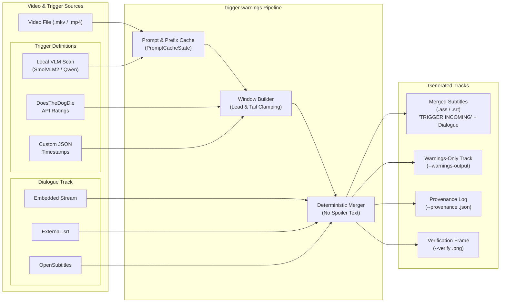

# Trigger Warnings

[](pyproject.toml)
[](https://github.com/alexfur/trigger-warnings/actions/workflows/tests.yml)
[](LICENSE)
[](https://pypi.org/project/trigger-warnings/)

Add advance warnings to the subtitles of a local video. The output combines
dialogue with a generic `TRIGGER INCOMING` warning, without naming the trigger
on screen. Load the new subtitle file in your video player.

The default workflow scans your video locally on Apple Silicon using a vision-language
model. No API accounts or third-party services are required.

[Scan a video with local AI](#scan-a-video-with-local-ai) ·
[Supply your own timestamps](#supply-your-own-timestamps) ·
[Recipes](#recipes)




## Scan a video with local AI

The AI runs on your Mac. Your video stays on your computer. It scans the video
before you watch and then creates a subtitle file; this is not a live playback
warning system.

### 1. Install

You need:

- A Mac with an Apple M-series chip, such as M1 or M2.
- Python 3.10 or newer.
- [Homebrew](https://brew.sh/) for the FFmpeg install command below.

Run these commands in Terminal:

```bash
brew install ffmpeg
python3 -m pip install 'trigger-warnings[vision]'
```

FFmpeg reads the video container. The `vision` extra installs local AI model
support on Apple Silicon.


### 2. Choose the video and triggers

Replace `movie.mkv` with your video's path and describe each trigger in a
separate `--model-trigger` option. Quote paths containing spaces.

```bash
trigger-warnings \
  --video "movie.mkv" \
  --model-trigger 'blood' \
  --model-trigger 'a person holding a gun' \
  --output "movie.warnings.ass"
```

The scan displays a live bar on stderr, including a heartbeat while the model
loads or checks frames. It shows completed checks, elapsed time and an estimated
time remaining. Captured output gets a bar snapshot every five seconds.

To watch the scan in a separate terminal window:

```bash
python3 scripts/scan-in-terminal.py --json \
  --video "movie.mkv" --model-trigger 'blood' --output "movie.warnings.ass"
```

`--json` keeps the final result on stdout. Add `--progress-json` only when a
program needs JSON progress on stderr; this replaces the visual bar:

```bash
trigger-warnings --json --progress-json \
  --video "movie.mkv" \
  --model-trigger 'blood' \
  --output "movie.warnings.ass"
```

This example uses an English subtitle track embedded in the video. If you
have a separate SRT file, add `--subtitles "movie.srt"` to the command.

To check which embedded tracks are available before scanning:

```bash
trigger-warnings --video "movie.mkv" --list-streams
```

Use `--stream INDEX` to select an index from that list, or `--language CODE`
to change the preferred language (default: `eng`). If the video has no usable
subtitle track, supply an SRT file.

**SmolVLM2 is the default model:**
`mlx-community/SmolVLM2-500M-Video-Instruct-mlx`. The first scan downloads
the model from Hugging Face. Later runs reuse the cached files. More triggers
mean more model checks and a longer scan.

### 3. Load the result

When the command reports `Wrote movie.warnings.ass`, open the video in VLC
and select **Subtitle → Add Subtitle File** to load it. Warnings normally
start 20 seconds before each detected event; `--lead` changes that interval.

> [!IMPORTANT]
> The video and original subtitle file remain unchanged. Existing output files
> are never overwritten. Choose a new output name when running again.

> [!WARNING]
> AI results are candidate timestamps, not verified detections. By default,
> the model checks one frame per second in 10-second chunks and marks the whole
> positive chunk. It can miss brief events or flag scenes incorrectly.
> This scanner checks images, not audio. Review the output before relying on it.
> No candidates means no subtitle is written; it does not mean the video is
> free of your triggers. A warning ending is never an all-clear.

### Optional: choose another model

Use `--model` to override SmolVLM2, for example with Qwen2.5-VL:

```bash
trigger-warnings \
  --video "movie.mkv" \
  --model "mlx-community/Qwen2.5-VL-7B-Instruct-4bit" \
  --model-trigger 'blood' \
  --output "movie.qwen-warnings.ass"
```

Qwen is optional. The repository's [initial benchmark](docs/experiments/prescan-m4.md)
measures SmolVLM2 on synthetic footage, not Qwen or real trigger-detection accuracy.

| Option | Default | Purpose |
| --- | --- | --- |
| `--model-trigger-desc` | Unspecified | Prompt description for a trigger (`LABEL=DESC`) to reduce false positives |
| `--provider` | `local` | Scanning provider: `local` (offline Apple Silicon MLX) or `gemini` (Google Cloud) |
| `--gemini-api-key` | Env var | Google AI Studio API key (falls back to `GEMINI_API_KEY`) |
| `--gemini-model` | `gemini-2.0-flash` | Gemini model for cloud scanning |
| `--no-gemini-sanitize` | Off | Skip local FFmpeg metadata stripping and downscaling before upload |
| `--model-fps` | `1` | Frames sampled per second (local model) |
| `--model-chunk` | `10` | Video seconds checked per chunk (local model) |
| `--model-width` | `384` | Extracted frame width in pixels (local model) |
| `--model-max-tokens` | `16` | Maximum length of each model answer (local model) |
| `--model-revision` | Unspecified | Pin a model revision (local model) |
| `--progress-json` | Off | Emit structured progress on stderr |

### 4. Cloud scanning with Google Gemini (~2 min whole-movie scan)

For whole-movie analysis in ~2 minutes instead of 25–35 minutes locally, use the Google Gemini cloud provider:

```bash
pip install 'trigger-warnings[gemini]'
export GEMINI_API_KEY="your-api-key"
```

Scan using `--provider gemini`:

```bash
trigger-warnings \
  --video "movie.mkv" \
  --provider gemini \
  --model-trigger 'eyes' \
  --model-trigger-desc 'eyes=an attack, gouging, blinding, or severe physical injury to someone'\''s eye' \
  --output "movie.warnings.ass"
```

**Privacy & Guardrails:**
- **Local metadata stripping:** FFmpeg automatically strips container metadata, rip tags, and chapter titles before upload.
- **Hardware downscale:** Re-encodes locally to 480p to reduce file size by ~80% for fast upload (~20s).
- **Randomized filename:** Uploads to Google's File API under a randomized hash name.
- **Guaranteed cleanup:** Automatically deletes the remote file from Google servers immediately after the scan completes.

## Supply your own timestamps

If you already have timestamps, you can provide them directly without running an
AI model. Save this as `events.json`:

```json
[
  {"start": 125.5, "end": 138, "label": "loud noises", "severity": "moderate"},
  {"start": "00:12:05.000", "label": "flashing lights"}
]
```

`start` accepts seconds or `HH:MM:SS.mmm`. `end` and `severity` are
optional. Without an end time, the warning stops at the event start, which
is not a safe point to resume watching.

```bash
trigger-warnings --subtitles "movie.srt" \
  --events events.json --output "movie.warnings.ass"
```

To try this route without preparing files, use the synthetic examples:

```bash
trigger-warnings --subtitles examples/dialogue.srt \
  --events examples/events.json --output example.warnings.ass
```

## Recipes

### Recipe: Import timestamps from DoesTheDogDie

If you prefer to import community-contributed timestamps instead of running a
local model or curating timestamps by hand, you can import them from DoesTheDogDie
(DDD). This requires an API key from [DoesTheDogDie](https://www.doesthedogdie.com/api).

To install the lightweight base package without AI model dependencies:

```bash
brew install ffmpeg
python3 -m pip install trigger-warnings
```

1. Get your own [DDD API key](https://www.doesthedogdie.com/api).
2. Run the setup command in your terminal and follow the hidden prompts:

   ```bash
   trigger-warnings --setup --save
   ```

3. Search for the title and choose the matching item ID:

   ```bash
   trigger-warnings --ddd-search 'Jaws' --ddd-year 1975
   ```

4. Generate warnings for the categories you choose:

   ```bash
   trigger-warnings --subtitles "movie.srt" \
     --ddd-item ITEM_ID --category 'a dog dies' \
     --output "movie.warnings.ass"
   ```

Repeat `--category` to select more labels. Omitting it selects every available
category for that item. Retain the `Powered by DoesTheDogDie.com` attribution in
downstream files.

> [!WARNING]
> Keep API keys out of chat, source control and logs. The setup command can
> save credentials in your operating system's keychain. `DDD_API_KEY` is the
> environment-variable alternative and overrides a stored key. Avoid
> `--ddd-api-key`: its value can appear in shell history and the process list.

### Recipe: Use DDD labels for a local AI scan

With local AI support installed, add `--model-from-ddd` to use an item's
community labels as the checklist while the model finds times in your video:

```bash
trigger-warnings --video "movie.mkv" \
  --ddd-item ITEM_ID --model-from-ddd --category 'a dog dies' \
  --output "movie.model-warnings.ass"
```

> [!NOTE]
> This mode takes labels from DDD's timestamped ratings, using them as the prompt
> list while replacing the timestamps with locally detected times. Use
> `--model-trigger` to supply labels directly when no timestamped ratings exist.

### Recipe: Generate warnings-only or dual subtitle tracks

You can generate both the dialogue subtitle merged with trigger warnings, and a separate subtitle track with only trigger warnings, in a single run:

```bash
trigger-warnings --subtitles "movie.srt" \
  --events events.json \
  --output "movie.warned.ass" \
  --warnings-output "movie.warnings-only.srt"
```

To create a subtitle track with only trigger warnings without requiring dialogue subtitles:

```bash
trigger-warnings --events events.json \
  --warnings-output "movie.warnings-only.srt"
```

Alternatively, pass `--output FILE --warnings-only`. Both `.ass` and `.srt` formats are supported.

## Other useful options

- `--output` accepts a new `.ass` or `.srt` filename.
- `--warnings-output FILE.ass|FILE.srt` writes a subtitle file containing only trigger warnings. Combine with `--output` to generate both tracks in one run, or use alone without dialogue subtitles.
- `--warnings-only` writes only trigger warnings into `--output`, without merging or requiring dialogue subtitles.
- `--provenance FILE.json` saves source, timing settings and result counts.
- `--verify FILE.png` renders one preview frame; it requires `--video` and FFmpeg.
- `--dry-run` writes no files. With a local model, it still runs the scan.
- `--json` returns one result on stdout at the end. Model progress uses stderr.
- `--progress-json` emits structured progress events as JSON lines on stderr
  (useful with `--json` mode). Fields: `type: "progress"`,
  `event: "stage"|"trigger"|"heartbeat"|"finish"`, `stage`,
  `chunk`, `total_chunks`, `trigger_index`, `total_triggers`, `trigger_name`,
  `percent` and `elapsed_seconds`. A finish event also reports failure or
  cancellation in `stage`; the final stdout result determines success.
- OpenSubtitles supplies dialogue only through `--os-search` and `--os-file`.
  It needs your own account and API key.

Run `trigger-warnings --help` for all flags. Coding agents should
follow the [agent skill](skills/trigger-warnings/SKILL.md): check `ok`, read
`notes` and `messages`, and use `filesWritten` to confirm output was created.

## Contributing and licence

```bash
python3 -m unittest discover -s tests -v
```

Set `RUN_MEDIA_TESTS=1` to include FFmpeg integration tests. See
[CONTRIBUTING.md](CONTRIBUTING.md) for development rules and
[SECURITY.md](SECURITY.md) for vulnerability reporting. Never commit private
trigger profiles, credentials or commercial media and subtitle files.

[MIT licence](LICENSE). Videos, subtitles and event data you supply are not
covered by the project's licence.
