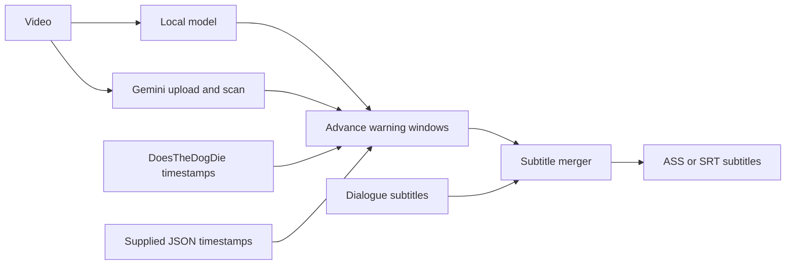

# Trigger Warnings

[](pyproject.toml)
[](LICENSE)
[](https://pypi.org/project/trigger-warnings/)

Spoiler-free trigger warnings for local video files. This is an experimental
alpha. It detects or imports known triggers and inserts a `TRIGGER INCOMING`
banner into a new ASS or SRT subtitle file, without naming the trigger on
screen. Load the file in your video player.

> [!WARNING]
> AI detections can miss events or flag scenes incorrectly. Review timestamps
> before relying on them. No candidates does not mean the video is trigger-free;
> a warning ending is never an all-clear.

[](assets/demo.gif)

[Scan locally with AI](#scan-a-video-with-local-ai) ·
[Cloud scan with Gemini](#cloud-scan-with-google-gemini) ·
[Supply your own timestamps](#supply-your-own-timestamps) ·
[Recipes](#recipes) ·
[CI checks](https://github.com/alexfur/trigger-warnings/actions/workflows/tests.yml)


## Scan a video with local AI

The AI runs entirely on your Mac. Your video never leaves your computer. The
scan runs before you watch and creates a subtitle file; this is not a live
playback warning system.

### Requirements

- Apple M-series Mac (M1 or later).
- Python 3.10 or newer.
- [Homebrew](https://brew.sh/) for FFmpeg.

### Install

```bash
brew install ffmpeg
python3 -m venv .venv
source .venv/bin/activate
pip install 'trigger-warnings[vision]==0.4.0a3'
```

FFmpeg reads the video container. The `vision` extra installs local AI model
support on Apple Silicon. The default model is
`mlx-community/SmolVLM2-500M-Video-Instruct-mlx`. The first scan downloads it
from Hugging Face; later runs reuse the cached files.

### Choose the video and triggers

Replace `movie.mkv` with your video's path. Describe each trigger in a
separate `--model-trigger` option. Quote paths containing spaces.

```bash
trigger-warnings \
  --video "movie.mkv" \
  --model-trigger 'blood' \
  --model-trigger 'a person holding a gun' \
  --output "movie.warnings.ass"
```

The scan displays a live progress bar on stderr, including a heartbeat while
the model loads or checks frames. It shows completed checks, elapsed time, and
estimated time remaining.

### Load the result

When the command reports `Wrote movie.warnings.ass`, open the video in VLC
and select **Subtitle → Add Subtitle File** to load it. Warnings start 20
seconds before each detected event by default; `--lead` changes that interval.

By default, the local model checks one frame per second in 10-second chunks
and marks each positive chunk as a candidate interval. It checks images, not
audio, and can miss brief events or flag scenes incorrectly.

> [!IMPORTANT]
> The video and original subtitle file remain unchanged. Existing output files
> are never overwritten. Choose a new output name when running again.

### Check embedded subtitle streams

```bash
trigger-warnings --video "movie.mkv" --list-streams
```

Use `--stream INDEX` to select an index from that list, or `--language CODE`
to change the preferred language (default: `eng`). If the video has no usable
subtitle track, supply an external SRT file with `--subtitles "movie.srt"`.

### Choose another model

Use `--model` to override SmolVLM2, for example with Qwen2.5-VL:

```bash
trigger-warnings \
  --video "movie.mkv" \
  --model "mlx-community/Qwen2.5-VL-7B-Instruct-4bit" \
  --model-trigger 'blood' \
  --output "movie.qwen-warnings.ass"
```


## Cloud scan with Google Gemini

The cloud provider sends video and audio to Google for analysis. A sanitisation
pass runs locally first (metadata stripping and downscaling). If sanitisation
cannot complete, the scan aborts before any upload. You can skip sanitisation
with `--no-sanitize` (or the legacy `--no-gemini-sanitize`) to upload the
original file. The tool attempts to delete every uploaded file after scanning
and reports deletion failures. Deletion is best-effort, not guaranteed.
Metadata removal does not anonymise the video or audio content.

Runtime depends on video length, encoding, connection speed and model
availability. API usage may incur charges on your Google account.

### Requirements

- Google AI Studio API key.
- Python 3.10 or newer (the `google-genai` package requires it).
- FFmpeg on your PATH (the command below uses Homebrew on macOS).
- The `gemini` extra.

### Install

```bash
brew install ffmpeg
python3 -m venv .venv
source .venv/bin/activate
pip install 'trigger-warnings[gemini]==0.4.0a3'
export GEMINI_API_KEY="your-api-key"
```

### Scan

```bash
trigger-warnings \
  --video "movie.mkv" \
  --provider gemini \
  --model-trigger 'eyes' \
  --model-trigger-desc 'eyes=an attack, gouging, blinding, or severe physical injury to someone'\''s eye' \
  --output "movie.warnings.ass"
```

| Option | Default | Purpose |
| --- | --- | --- |
| `--provider` | `local` | `local` (Apple Silicon MLX) or `gemini` (Google Cloud) |
| `--cloud-api-key` | Env var | API key for cloud provider; falls back to `CLOUD_API_KEY` or `GEMINI_API_KEY` |
| `--cloud-model` | Provider default | Model for cloud provider (gemini default: `gemini-3.6-flash`) |
| `--no-sanitize` | Off | Skip local metadata stripping and downscaling before cloud upload |
| `--gemini-api-key` | Env var | Alias for `--cloud-api-key` (backward compatible) |
| `--gemini-model` | `gemini-3.6-flash` | Alias for `--cloud-model` (backward compatible) |
| `--no-gemini-sanitize` | Off | Alias for `--no-sanitize` (backward compatible) |


## Supply your own timestamps

If you already have timestamps, provide them directly without running an AI
model. The base PyPI package handles this without any AI dependencies:

```bash
pip install 'trigger-warnings==0.4.0a3'
```

Save this as `events.json`:

```json
[
  {"start": 125.5, "end": 138, "label": "loud noises", "severity": "moderate"},
  {"start": "00:12:05.000", "label": "flashing lights"}
]
```

`start` accepts seconds or `HH:MM:SS.mmm`. `end` and `severity` are
optional. Without an end time, the warning stops at the event start, which
is not a safe point to resume watching.

```bash
trigger-warnings --subtitles "movie.srt" \
  --events events.json --output "movie.warnings.ass"
```

## Recipes

### Import timestamps from DoesTheDogDie

Import community-contributed timestamps instead of running a local model or
curating timestamps by hand. This requires an API key from
[DoesTheDogDie](https://www.doesthedogdie.com/api).

Use the base-package installation from [Supply your own timestamps](#supply-your-own-timestamps).
An existing SRT file needs no FFmpeg or AI dependencies.

1. Get your own [DDD API key](https://www.doesthedogdie.com/api).
2. Run the setup command in your terminal and follow the hidden prompts:

   ```bash
   trigger-warnings --setup --save
   ```

3. Search for the title and choose the matching item ID:

   ```bash
   trigger-warnings --ddd-search 'Jaws' --ddd-year 1975
   ```

4. Generate warnings for the categories you choose:

   ```bash
   trigger-warnings --subtitles "movie.srt" \
     --ddd-item ITEM_ID --category 'a dog dies' \
     --output "movie.warnings.ass"
   ```

Repeat `--category` to select more labels. Omitting it selects every available
category for that item. Retain the `Powered by DoesTheDogDie.com` attribution in
downstream files.

> [!WARNING]
> Keep API keys out of chat, source control, and logs. The setup command can
> save credentials in your operating system's keychain. `DDD_API_KEY` is the
> environment-variable alternative and overrides a stored key. Avoid
> `--ddd-api-key`: its value can appear in shell history and the process list.

### Use DDD labels for a local AI scan

With local AI support installed, add `--model-from-ddd` to use an item's
community labels as the checklist while the model finds times in your video:

```bash
trigger-warnings --video "movie.mkv" \
  --ddd-item ITEM_ID --model-from-ddd --category 'a dog dies' \
  --output "movie.model-warnings.ass"
```

> [!NOTE]
> This mode takes labels from DDD's timestamped ratings, using them as the prompt
> list while replacing the timestamps with locally detected times. Use
> `--model-trigger` to supply labels directly when no timestamped ratings exist.

### Generate warnings-only or dual subtitle tracks

Generate both the dialogue subtitle merged with trigger warnings and a
separate warnings-only track in a single run:

```bash
trigger-warnings --subtitles "movie.srt" \
  --events events.json \
  --output "movie.warned.ass" \
  --warnings-output "movie.warnings-only.srt"
```

To create a warnings-only track without requiring dialogue subtitles:

```bash
trigger-warnings --events events.json \
  --warnings-output "movie.warnings-only.srt"
```

Alternatively, pass `--output FILE --warnings-only`. Both `.ass` and `.srt`
formats are supported.


## Other options

- `--output` accepts a new `.ass` or `.srt` filename.
- `--warnings-output FILE` writes a subtitle file containing only trigger
  warnings. Combine with `--output` to generate both tracks in one run, or
  use alone without dialogue subtitles.
- `--warnings-only` writes only trigger warnings into `--output`, without
  merging or requiring dialogue subtitles.
- `--lead SECONDS` sets the advance warning duration (default: 20).
- `--tail SECONDS` adds extra time after a known event end (default: 0).
- `--offset SECONDS` shifts event times by a constant; never shifts dialogue.
- `--provenance FILE.json` saves source, timing settings, and result counts.
- `--verify FILE.png` renders one preview frame; requires `--video` and FFmpeg.
- `--dry-run` writes no files. With a local model, it still runs the scan.
- `--json` returns one result on stdout at the end. Model progress uses stderr.
- `--progress-json` emits structured progress events as JSON lines on stderr
  (useful with `--json` mode).
- `--model-fps`, `--model-chunk`, `--model-width`, `--model-max-tokens` control
  local model sampling. Defaults: 1 fps, 10 s chunks, 384 px width, 16 tokens.
- OpenSubtitles supplies dialogue only through `--os-search` and `--os-file`.
  It needs your own account and API key.

Run `trigger-warnings --help` for all flags. Coding agents should
follow the [agent skill](skills/trigger-warnings/SKILL.md): check `ok`, read
`notes` and `messages`, and use `filesWritten` to confirm output was created.


## Architecture




## Contributing and licence

```bash
python3 -m unittest discover -s tests -v
```

Set `RUN_MEDIA_TESTS=1` to include FFmpeg integration tests. See
[CONTRIBUTING.md](CONTRIBUTING.md) for development rules and
[SECURITY.md](SECURITY.md) for vulnerability reporting. Never commit private
trigger profiles, credentials, or commercial media and subtitle files.

[MIT licence](LICENSE). Videos, subtitles, and event data you supply are not
covered by the project's licence.
